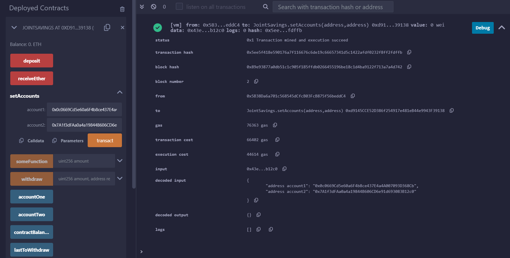
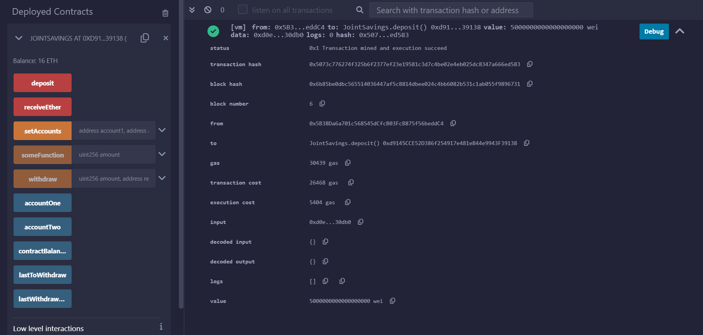
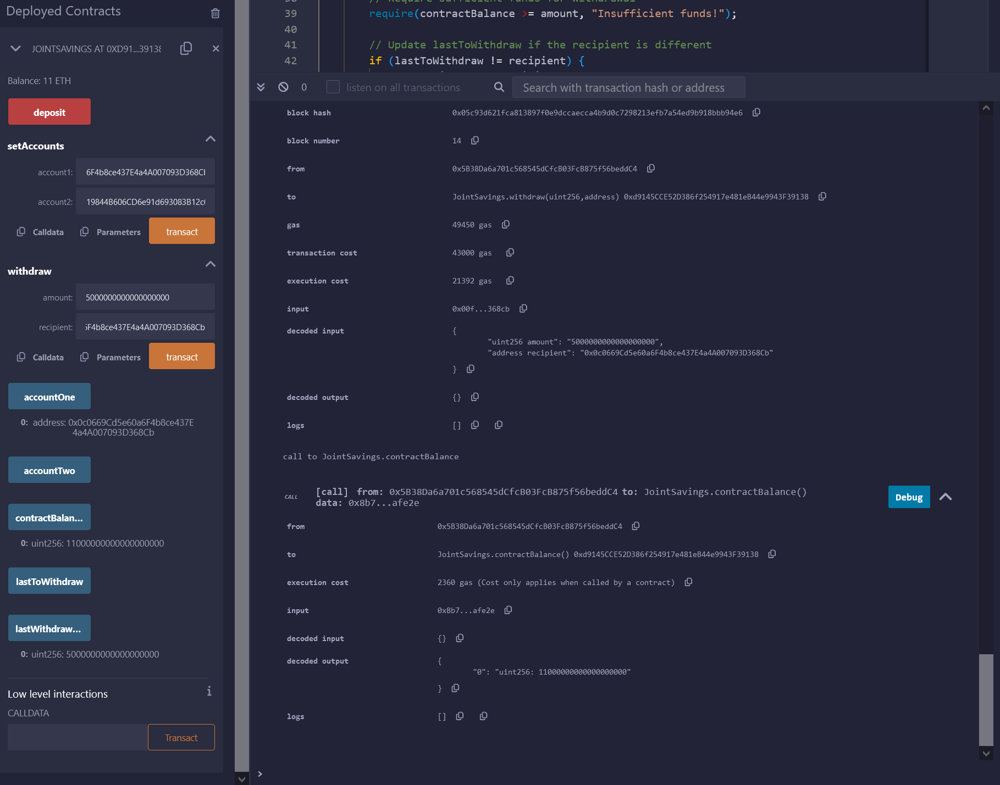
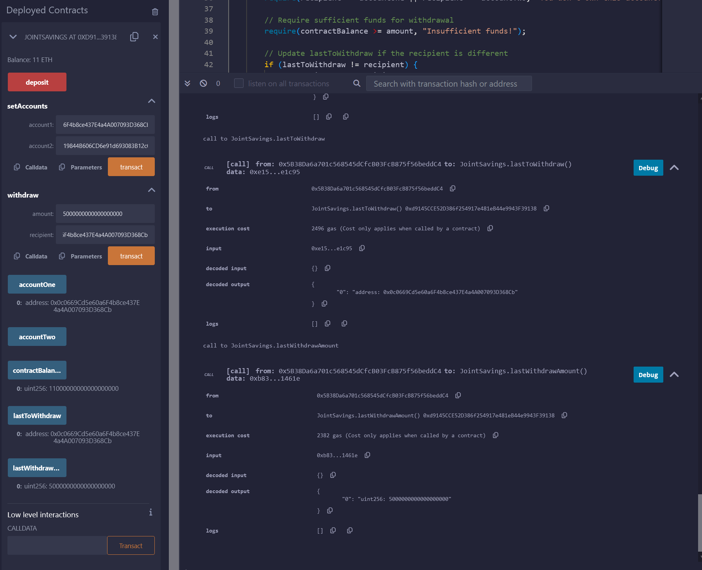
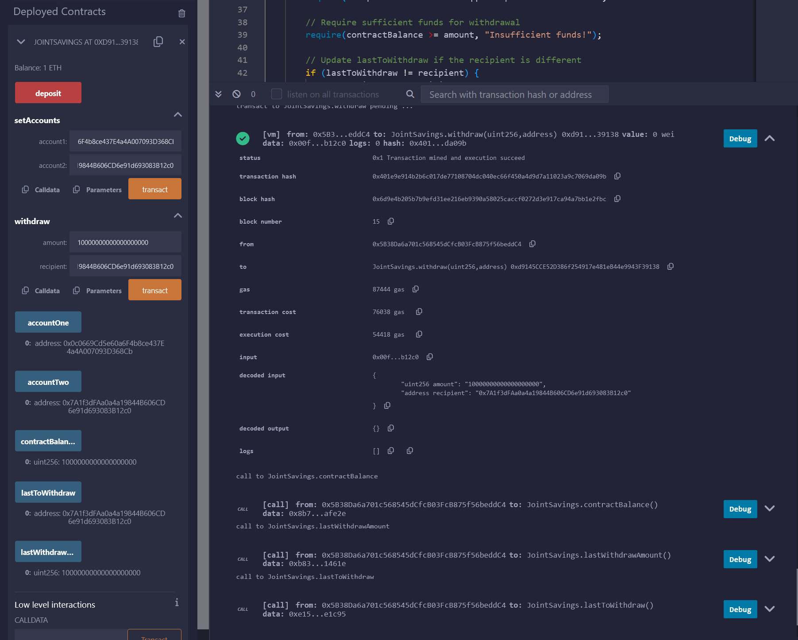

# Module-20-Challenge
In this repository you will find a .sol file named Final Joint Savings Jobs, in this file we are creating a Solidity smart contract that accepts two user addresses. These addresses will be able to control a joint savings account. This smart contract will use ether management functions to implement a financial institution’s requirements for providing the features of the joint savings account. These features will consist of the ability to deposit and withdraw funds from the account.

# Part 1 Create a Joint Savings Account Contract in Solidity
In this section, we will Create a Joint Savings Account Contract in Solidity

Define a new contract named JointSavings.

Define two variables of type address payable named accountOne and accountTwo,

a variable of type address public named lastToWithdraw,

two variables of type uint public named lastWithdrawAmount and contractBalance.

Define a function named withdraw that accepts two arguments: amount of type uint and recipient of type payable address.

Define a require statement that checks if recipient is equal to either accountOne or accountTwo. If it isn’t, the require statement will return the “You don't own this account!” text.

Define a require statement that checks if balance is sufficient for accomplishing the withdrawal operation. If insufficient funds exist, it will return the “Insufficient funds!” text.

Add an if statement to check if lastToWithdraw is not equal to (!=) recipient. If it isn’t equal, set it to the current value of recipient.

Call the transfer function of the recipient, and pass it the amount to transfer as an argument.

Set lastWithdrawAmount equal to amount.

Set the contractBalance variable equal to the balance of the contract by using address(this).balance to reflect the new balance of the contract.

Define a public payable function named deposit. 

Set the contractBalance variable equal to the balance of the contract.
Define a public function named setAccounts that takes two address payable arguments, named account1 and account2.

Add a fallback function so that my contract can store ether that’s sent from outside the deposit function.

# Part 2 Compile and Deploy Your Contract in the JavaScript VM
In this part we will compile the smart contract. If an error occurs, make the necessary changes for a successful compilation.

Deploy smart contract, and confirm that it successfully deployed.

# Part 3 Interact with Your Deployed Smart Contract
In this section, we will test its functionality. After each step, capturing a screenshot of the execution, and then save it in a folder named Execution_Results. 

